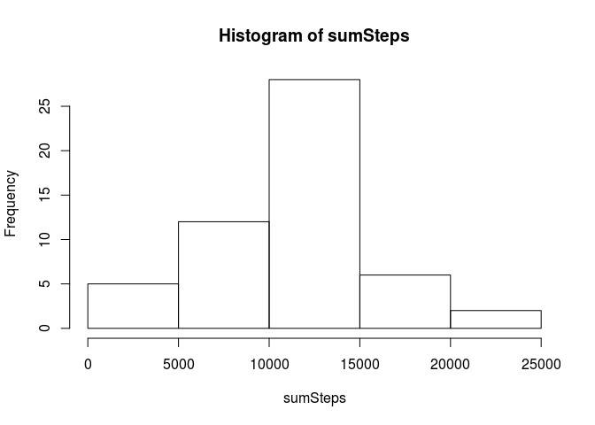
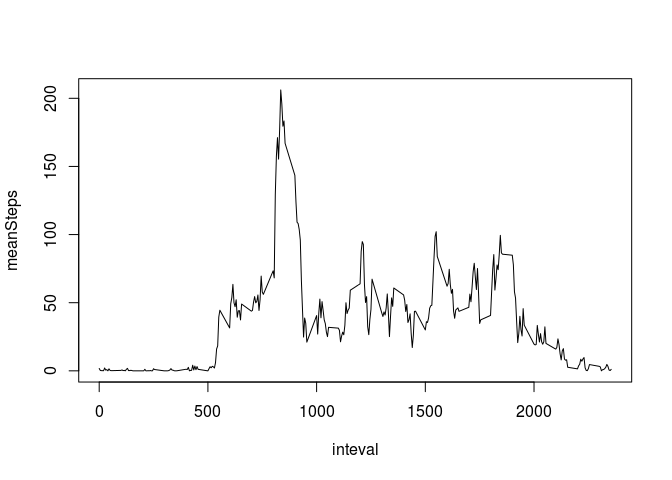
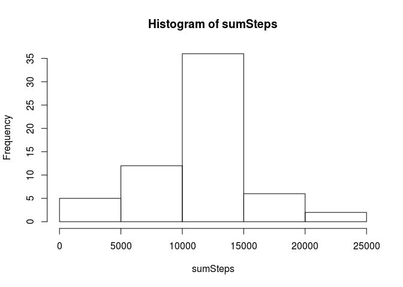
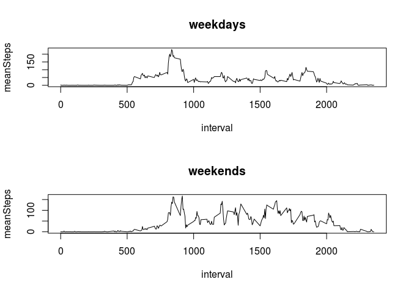

# Reproducible Research: Peer Assessment 1


## Loading and preprocessing the data


```r
  library("ggplot2")
  data = read.csv("activity.csv")
  data$date = as.Date(as.character(data$date))
```


## What is mean total number of steps taken per day?


```r
  cleanedData = data[!is.na(data$steps),] 
  ag1 = aggregate(cleanedData[, 1], list(cleanedData$date), sum)
  colnames(ag1) = c("date", "sumSteps")
  hist(ag1$sumSteps, xlab = "sumSteps", main = "Histogram of sumSteps")
```

 


```r
  meanSteps = mean(ag1$sumSteps)
  medianSteps = median(ag1$sumSteps)
```

Mean of total number of steps taken per day is 10766.1886792453. Median is 10765.


## What is the average daily activity pattern?


```r
  ag2 = aggregate(cleanedData[, 1], list(cleanedData$interval), mean)
  colnames(ag2) = c("inteval", "meanSteps")
  plot(ag2, type = "l")
```

 


```r
  maxInterval = ag2$inteval[max(ag2$meanSteps) ]
```

Interval, on average across all the days in the dataset, which contains the maximum number of steps is 1705.

## Imputing missing values


```r
  nMissed = nrow(data[!complete.cases(data), ])
```

Total number of rows with NA's is 2304.

All missing values are filled by mean for 5-minute intervals.


```r
  filledData = data
  filledData$steps[is.na(filledData$steps)] = ag2$meanSteps[match(ag2$inteval, filledData$interval)]

  ag3 = aggregate(filledData[, 1], list(filledData$date), sum)
  colnames(ag3) = c("date", "sumSteps")
  hist(ag3$sumSteps, xlab = "sumSteps", main = "Histogram of sumSteps")
```

 


```r
  meanSteps3 = mean(ag3$sumSteps)
  medianSteps3 = median(ag3$sumSteps)
```

New mean is 10766.1886792453, and is the same value as before. New median is 10766.1886792453 and is different then before. Changing NA to mean will not change the mean, but can change the median (if mean is equals median, median will also not change).

## Are there differences in activity patterns between weekdays and weekends?


```r
  weekend = c( "Saturday", "Sunday")
  weekData = filledData
  weekData$typeOfDay = weekdays(weekData$date)
  weekData$typeOfDay = as.factor(ifelse(weekData$typeOfDay %in% weekend, "weekend", "weekday"))
  ag4 = aggregate(weekData[, 1], list(weekData$interval, weekData$typeOfDay), mean)
  colnames(ag4) = c("interval", "typeOfDay", "meanSteps")
  par(mfrow = c(2, 1))
  with(ag4[ ag4$typeOfDay == "weekday",], plot(x = interval, y = meanSteps, type = "l", main = "weekdays"))
  with(ag4[ ag4$typeOfDay == "weekend",], plot(x = interval, y = meanSteps, type = "l", main = "weekends"))
```

 

